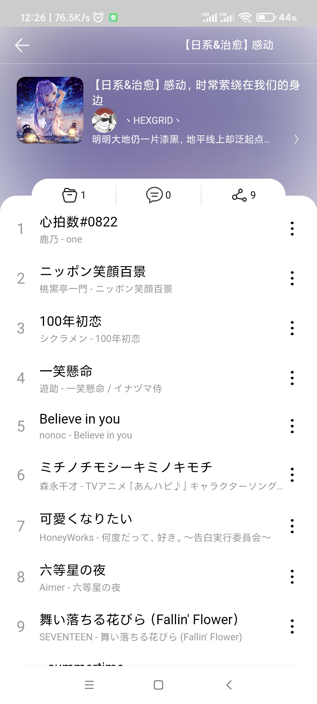
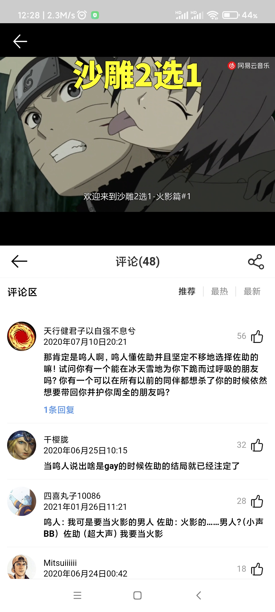

# 仿移动端网易云音乐

-------------------
### 运行项目
```
npm install
npm run serve
```
### 打包项目
```
npm run build
```
-------------------


### 前端
-------------------
整体采用vue编写，综合使用了vue-cli，vuerouter，vuex以及axios，其中，通过vue-cli搭建项目、vue-router设置界面跳转逻辑，vuex共享状态以及通过axios进行网络请求。在界面ui方面则是部分使用了vant-ui框架，滚动则采用了better-scroll适应移动端的滚动。关于移动端适配方案则是采用了px2rem-loader插件将px转换成rem，换算单位是38px=1rem，并保留三位小数点。

-------------------
### 后端
-------------------
采用了网易云音乐api
Github：[https://github.com/Binaryify/NeteaseCloudMusicApi](https://github.com/Binaryify/NeteaseCloudMusicApi)

详情请参考官方文档：[网易云音乐API](https://neteasecloudmusicapi.vercel.app/#/)

-------------------

### 功能简介
-------------------
- 用户登录(手机号登录)
- 搜索(热搜榜、搜索建议、搜索列表)
- 首页(展示轮播图、推荐歌单、推荐歌曲、精选视频、新歌与新专辑、热门歌手)
- 每日推荐
- 私人FM
- 歌单广场
- 排行榜
- 电台(个性推荐、今日优选、热门电台、推荐声音，分类推荐)
- 分类下的视频
- 展示用户信息(创建的歌单、收藏的歌单、喜欢的音乐、已购音乐、最近播放、用户名)
- 歌单(展示歌单详细信息、修改个人歌单信息以及添加删除歌曲)
- 评论(歌曲评论、电台评论、视频评论、歌单评论)
- 歌曲播放器、电台播放器以及视频播放器
- 喜欢该歌曲

----------------------

### 界面展示
-------------------
#### 主页面部分


#### 搜索部分


#### 播放器部分


#### 歌单部分



#### 评论部分



-------------------

### 存在问题
-------------------

1. 代码有点不规范，没有使用ESlint，样式那些没有进行初始化，都是在具体的组件里改的

2. 图片没做懒加载，没有默认图片，未加载时图片框无高度

3. 评论有时会请求不了，参数错误

4. 视频的分类依据是所有标签以及分类词条

5. 没实现侧边栏与个人详情界面

-------------------


